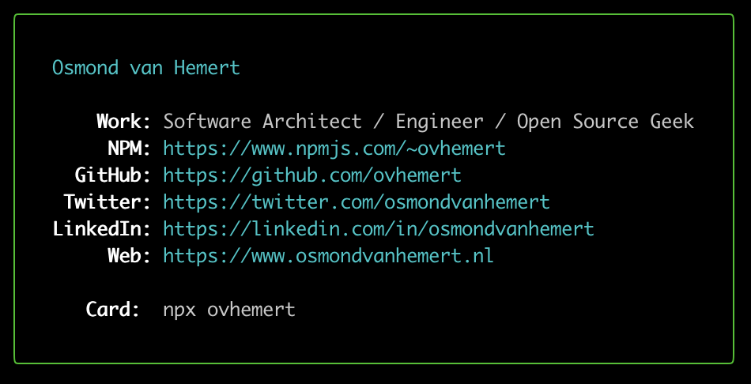

# My NPM Business Card

[](https://travis-ci.com/ovhemert/npmcard-ovhemert)
[](https://david-dm.org/ovhemert/npmcard-ovhemert)
[](https://snyk.io/test/npm/ovhemert)
[](https://coveralls.io/github/ovhemert/npmcard-ovhemert)
[](http://standardjs.com/)

Shows my NPM card in the terminal.



## Try it

``` sh
$ npx ovhemert
```

## Create your own

Use the [npmcard](https://www.npmjs.com/package/npmcard) library.

``` sh
$ npm install npmcard
```

## Maintainers

Osmond van Hemert
[](https://github.com/ovhemert)
[](https://ovhemert.dev)

## License

Licensed under [MIT](./LICENSE).
